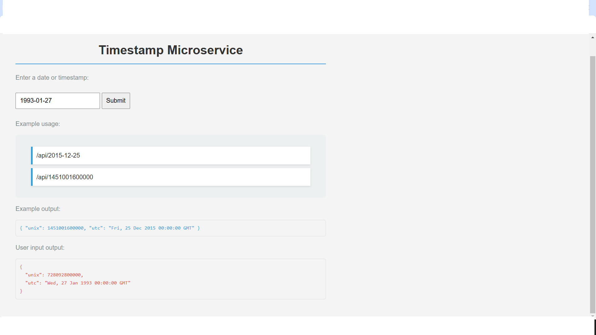

# Timestamp Microservice



This is a simple timestamp microservice built with Node.js and Express.

## Usage

- A request to `/api/:date?` with a valid date should return a JSON object with a `unix` key that is a Unix timestamp of the input date in milliseconds (as type Number).
- A request to `/api/:date?` with a valid date should return a JSON object with a `utc` key that is a string of the input date in the format: `Thu, 01 Jan 1970 00:00:00 GMT`.
- A request to `/api/1451001600000` should return `{ unix: 1451001600000, utc: "Fri, 25 Dec 2015 00:00:00 GMT" }`.
- Your project can handle dates that can be successfully parsed by `new Date(date_string)`.
- If the input date string is invalid, the API returns an object having the structure `{ error : "Invalid Date" }`.
- An empty date parameter should return the current time in a JSON object with a `unix` key.
- An empty date parameter should return the current time in a JSON object with a `utc` key.

## Installation

1. Clone the repository:
    ```bash
    git clone https://github.com/alyatalla/Timestamp-Microservice.git
    cd Timestamp-Microservice
    ```

2. Install dependencies:
    ```bash
    npm install
    ```

3. Start the server:
    ```bash
    npm start
    ```

4. Open your browser and navigate to `http://localhost:3000`.

## Deployment

This project is configured to be deployed on Netlify. The `netlify.toml` file contains the necessary settings.

## Screenshot


